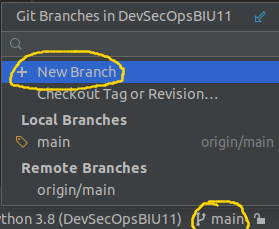
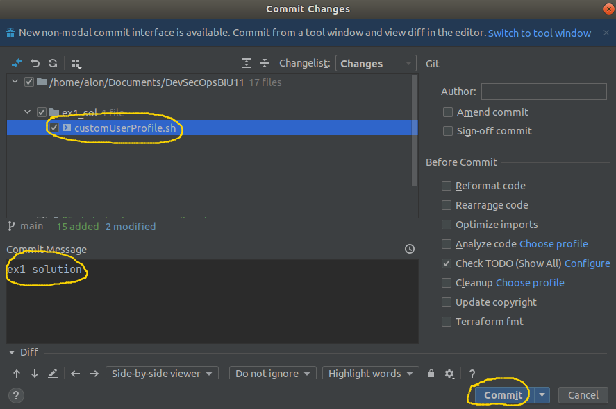

# Default profile for new Linux Users

In this exercise, you will implement a bash script which applies default Bash profile configurations for new added Linux users.

## Perliminaries 

Open (or clone if you didn't do it yet: Git -> clone...) [our shared git repo](https://github.com/alonitac/DevOpsMay22.git) in PyCharm and pull the repository  to get an up-to-date version of the repository. 
From Pycharm button right bar, create your own git branch (Git branches will be discussed later):

Then change `<alias>` to your nickname. e.g. `bash_ex1/alonit`. The branch name must start with `bash_ex1/`

Great. Let's get started... 

## Background 

In many Linux systems, the `/etc/skel` directory provides a way to assure new users are added to your Linux system has default 
Bash profile configurations.
When adding a new user with **useradd** (with the `-m` parameter), it will create the user's home directory and copy files from `/etc/skel` to the new user's home directory.

## Guidelines

**Note:** should be done in Ubuntu systems.

1. In `/etc/skel` edit `.bash_profile` file using your favorite text editor (`nano`, `vi` etc...) as detailed below. If this file already exists, append your code at the end (it's highly recommended to making a backup copy before). 
   1. Greet the user. e.g. if the user is **john**, the message `Hello john` will be printed to stdout (standard output). 
   2. Print how many packages are outdated (`/usr/lib/update-notifier/apt-check --human-readable`).
   3. Given a file called `.token` in the home directory of the user, check the file permissions. If the octal representation of the permissions set is different from 600 (read and write by the user **only**), print a warning message to the user:  
      **Warning: .token file has too open permissions**   
      Use `stat -c "%a"` to get permissions set of the file in an octal form. Use _if_ statements to test if the file exists, and that the permissions are not equal to "600". 
2. Create a new Linux user using `useradd` command. If everything done well, the new user should have the custom script profile you created. 
3. Login to the new user terminal session: `su -l <username>`. Replace `<username>` to the created user.
   The output should be similar to:
   

## Submission 

When you're done with above section, under `ex1_sol/customUserProfile.sh` in our shared repo, create a complete bash script that set a custom profile for new users. 
What does it mean? Given a new clean installation of Ubuntu system, after running your script by `./customUserProfile.sh`, every new created user in this system should have a bash profile as described above. It means that your script should go to `/etc/skel`, edit the `.bash_profile` file and so on... 

Remarks:
   - You may assume that `etc/skel` exists, but not `.bash_profile` file (search how to check if a file exist).
   - Your script should run and complete without errors.
   - You can assume that the user that run your script is root (so no need to use `sudo`).

Finally, _commit_   **only** `ex1_sol/customUserProfile.sh` file as your solution. After clicking on commit button, write a commit message and make sure only your single solution file is committed, as follows:  
  

Then _push_  your solution to GitHub. 

## Well done!
