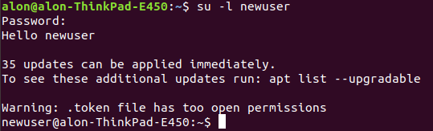

# Default profile for new Linux Users

In this exercise, you will implement a bash script which 

need to read the **useradd** man pages, because we are going to use the /etc/skel
directory to hold default shell configuration files, which are copied to the home directory of each newly added
user.

This should be run in Ubuntu 

## Background 

The `/etc/skel` directory provide a way to assure new users are added to your Linux system has default 
Bash configurations.
When adding a new user with **useradd**, use the `-m` parameter, which tells `useradd` to create the user's home directory and copy files from `/etc/skel` to the new user's home directory.

1. In `/etc/skel` edit `.bash_profile` file using your favorite text editor (`nano`, `vi` etc...) as below. If this file already exists, append your code at the end (it's highly recommended to making a backup copy before). 
   1. Greet the user. e.g. if the user is **john**, the message `Hello john` will be printed to stdout (standard output). 
   1. Print how many packages are outdated (`/usr/lib/update-notifier/apt-check --human-readable`).
2. Create a new Linux user using `useradd` command.
3. Login to the new user terminal session: `su -l <username>`. Replace `<username>` to the created user.
   The output should be similar to:
   
      