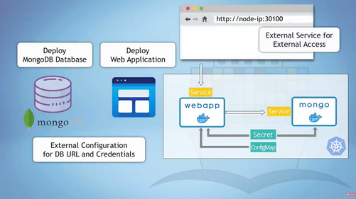

# Kubernetes Exercise

## The Mongo Project

The DevOps team in your organization is responsible to deploy the following architecture in K8S. 

The systems components are:

- A web app (`webapp`) provisioned in k8s as a `Deployment` with `1` replicas using the `nanajanashia/k8s-demo-app:v1.0` Docker image.
- A simple service for the `webapp` Deployment exposing port `3000`.
- A Mongo database (`mongo`) provisioned in k8s as a `Deployment` with `1` replicas using the `mongo:5.0` Docker image.
- A simple service for the `mongo` Deployment exposing port `27017`.
- A `ConfigMap` named `mongo-configs` containing the mongo db URL as given in the service exposing mongo.
- A `Secret` named `mongo-secret` which contains the username and password for the mongo db. 

Notes:
- Environments variables the `mongo` Deployment is expecting to get:
  - `MONGO_INITDB_ROOT_USERNAME` which is the username for the Mongo db defined in the `mongo-secret` Secret. 
  - `MONGO_INITDB_ROOT_PASSWORD` which is the password for the Mongo db defined in the `mongo-secret` Secret.
- Environments variables the `webapp` Deployment is expecting to get:
    - `USER_NAME` which is the username for the Mongo db defined in the `mongo-secret` Secret.
    - `USER_PWD` which is the password for the Mongo db defined in the `mongo-secret` Secret.
    - `DB_URL` which is the database URL of Mongo and defined in the `mongo-configs` ConfigMap.

Extensions:
- Expose the service of the `webapp` Deployment as a NodePort service type, port `30200`. 
- Convert the `mongo` Deployment to persist the data using a `StatefulSet` k8s object. 
- Deploy the [Mongo Express](https://hub.docker.com/_/mongo-express) app in the cluster and visit the app via `kubectl port-forward` to see the data in Mongo visually. 