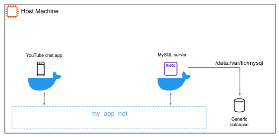

# Kubernetes Tutorials

## Install Minikube

https://minikube.sigs.k8s.io/docs/start/

## Install `kubectl`

1. Download the `kubectl` binary from [Kubernetes](https://kubernetes.io/docs/tasks/tools/install-kubectl-windows/#install-kubectl-binary-with-curl-on-windows) official site.


2. Put the `kubectl.exe` binary in a directory accessible in your PATH environment variable.

## Start K8S dashboard

Kubernetes Dashboard allows you to get easily acclimated to your new cluster.

1. Execute
```shell
minikube dashboard
```

2. To access the dashboard endpoint, open the following link with a web browser:
   http://127.0.0.1:36373/api/v1/namespaces/kubernetes-dashboard/services/http:kubernetes-dashboard:/proxy/


## Deploy the YouTube chat app as [**Pod**](https://kubernetes.io/docs/concepts/workloads/pods/)

Pods are the smallest deployable units of computing that you can create and manage in Kubernetes.
A Pod is a group of one or more **containers**, with shared storage and network resources, and a specification for how to run the containers.

1. In the k8s configuration file under `k8s/youtube-chat-app-pod.yaml` change `<docker-image-name>:<tag>` to a docker image name existed in your machine.
2. Load this image to Minikube by `minikube image load <docker-image-name>:<tag>` (this step is relevant for [Minikube users only](https://minikube.sigs.k8s.io/docs/handbook/pushing/#2-push-images-using-cache-command), in real cluster the image is being pulled from a private container registry).
3. Apply the configurations by: `kubectl apply -f k8s/youtube-chat-app-pod.yaml`

### Understanding Kubernetes Objects [:link:](https://kubernetes.io/docs/concepts/overview/working-with-objects/kubernetes-objects/)

Almost every Kubernetes object includes a nested object that govern the object's configuration: the object `spec`. 
The `spec` provides a description of the characteristics you want the resource to have: its **desired state**.

In the .yaml file for the Kubernetes object you want to create, you'll need to set values for the following fields:

- `apiVersion` - Which version of the Kubernetes API you're using to create this object.
- `kind` - What kind of object you want to create.
- `metadata` - Data that helps uniquely identify the object, including a name string, UID, and optional namespace.
- `spec` - What state you desire for the object.

**Labels** are key/value pairs that are attached to objects, such as Deployment.
Labels are intended to be used to specify identifying attributes of objects that are meaningful and relevant to users. E.g.:

- `"release" : "stable"`
- `"environment" : "dev"`
- `"tier" : "backend"`

Via a **Label Selector**, the client/user can identify a set of objects. 

## Deploy the YouTube chat app as [**Deployment**](https://kubernetes.io/docs/concepts/workloads/controllers/deployment/)

A Deployment provides declarative updates for **Pods** and **ReplicaSets**.
A ReplicaSet's purpose is to maintain a stable set of replica Pods running at any given time.

1. In the k8s configuration file under `k8s/youtube-chat-app-deployment.yaml` change `<docker-image-name>:<tag>` to a docker image name existed in your machine (build one if you need to).
2. Load this image to Minikube by `minikube image load <docker-image-name>:<tag>`.
3. Apply the configurations by: `kubectl apply -f k8s/youtube-chat-app-deployment.yaml`
4. Scale the app by changing `replicas: 1` to `replicas: 5`, apply your changes again. Make sure the ScaleSet increases your instances.
5. Perform a rolling update by deploying a new image version (e.g. from `0.0.1` to `0.0.2`) version.

## Pod lifecycle 

### Pod resources

> In order to complete the following demo, you need to install 
> a Metric server in the cluster.
> Metrics Server collects resource metrics (such as CPU and Memory usage) from Kubelets and exposes them in Kubernetes apiserver.
> If you are Minikube users, install it by the below command:
> ```text
> minikube addons enable metrics-server
> ```
> Or alternatively (for any other k8s cluster) by:
> ```shell
> kubectl apply -f https://github.com/kubernetes-sigs/metrics-server/releases/latest/download/components.yaml
> ```

In this exercise, you create a Pod that has one Container. The Container has a memory request of 50 MiB and a memory limit of 100 MiB. Here's the configuration file for the Pod:

1. Apply by `kubectl apply -f k8s/memory-stress-test.yaml`.
2. Use kubectl top to fetch the metrics for the pod:
```shell
kubectl top pod memory-demo
```

In the next exercise, you create a Pod that has one container. The container has a request of 0.5 CPU and a limit of 1 CPU. Here is the configuration file for the Pod:

1. Apply by `kubectl apply -f k8s/cpu-stress-test.yaml`.
2. Use kubectl top to fetch the metrics for the pod:
```shell
kubectl top pod cpu-demo
```

### Define liveness HTTP probes [:link:](https://kubernetes.io/docs/tasks/configure-pod-container/configure-liveness-readiness-startup-probes/)

1. Add the following liveness probe under to the `youtube-chat-app-deployment.yaml`, such that the `youtube-app` container spec will look like:
```yaml
containers:
   - name: youtube-app
     image: <docker-image-name>:<tag>
     livenessProbe:
      httpGet:
        path: /health
        port: 8080
      initialDelaySeconds: 3
      periodSeconds: 3
      failureThreshold: 3
```
2. Apply the changes.
3. (Optional) change the `/health` endpoint in `app/app.py` such that it will fail in 20-30 seconds after the app is up and running, watch k8s replacing unhealthy pods.
4. Add the following readiness probe under to the `youtube-chat-app-deployment.yaml`, such that the `youtube-app` container spec will look like:
```yaml
containers:
   - name: youtube-app
     image: <docker-image-name>:<tag>
     livenessProbe:
        httpGet:
           path: /health
           port: 8080
        initialDelaySeconds: 3
        periodSeconds: 3
        failureThreshold: 3
     readinessProbe:
        httpGet:
           path: /ready
           port: 8080
        initialDelaySeconds: 5
        periodSeconds: 5
```
5. Watch the behaviour of your app during rolling update.

## Pod horizontal autoscaler

A HorizontalPodAutoscaler (HPA) automatically updates a workload resource, with the aim of automatically scaling the workload to match demand.

1. First, let's stop and start the cluster with an extra configuration that will help us to monitor our pods in realtime:
```shell
minikube stop

# you may need to change the --driver to the driver the cluster is running on. 
minikube start --driver=docker  --extra-config=kubelet.housekeeping-interval=10s
```
2. To simulate a load on the app, we will use the `/load` endpoint defined in the `app.py` file (review it and make sure you understand what it does). 
3. Under `youtube-chat-app-deployment.yaml` add the following `resource` definition for the `youtube-app` container:
```yaml
- name: youtube-app
  image: <docker-image-name>:<tag>
  resources:
     limits:
        cpu: "200m"
     requests:
        cpu: "100m"
```
3. Build the image and deploy it in the cluster (update the `youtube-chat-app-deployment.yaml` according to the new image tag to apply the changes). 
4. Now that the server is running with the new endpoint, create the autoscaler:
```shell
kubectl apply -f k8s/youtube-chat-app-autoscale.yaml
```
4. Next, see how the autoscaler reacts to increased load. To do this, you'll start a different Pod to act as a client. The container within the client Pod runs in an infinite loop, sending queries to the php-apache service.
```shell
# Run this in a separate terminal so that the load generation continues and you can carry on with the rest of the steps
kubectl run -i --tty load-generator --rm --image=busybox:1.28 --restart=Never -- /bin/sh -c "while sleep 0.01; do wget -q -O- http://youtube-app-service:8080/load; done"
```
5. Watch the HPA in action by `kubectl get hpa -w`.
6. (Optional) Perform a rolling update **during scale**.

[Read more](https://kubernetes.io/docs/tasks/run-application/horizontal-pod-autoscale-walkthrough/) to see how k8s can scale based on _packets per second_, _requests per second_ or even metrics not related to Kubernetes objects (such as messages in queue).

## Secret and ConfigMap

Recall the multi-app architecture we created using Docker compose:



We would like to deploy it in the k8s cluster. 

**Before we begin, clean your cluster from resources.** You can stop and delete the cluster by `minikube stop && minikube delete`, and then start over again a new fresh cluster. 

### The YouTube chat app

1. For simplicity, you are given the app version that designed to talk with an external MySQL db. The code can be found in `app-multi`, so no need to switch branches. 
2. Build the image according to the Dockerfile in `app-multi`. 
3. Deploy it using the `youtube-chat-app-multi.yaml` configuration file (does it work? why?).
4. We would like to create a cluster [Secret](https://kubernetes.io/docs/concepts/configuration/secret/) object to store the root user password for the MySQL database. Review the secret object in `k8s/mysql-secret.yaml` and apply it:
```shell
kubectl apply -f k8s/mysql-secret.yaml
```
5. Deploy the MySQL deployment by applying `mysql-deployment.yaml` configuration file.
6. Test your app.

7. Now let's say we want to allow maximum of 50 connection to our DB. We would like to find a useful way to "inject" this config to our pre-built `mysql:5.7` image. For that, the [ConfigMap](https://kubernetes.io/docs/concepts/configuration/configmap/) object can assist.
   In the `mysql` Docker image, custom configurations for MySQL can be placed in `/etc/mysql/mysql.conf.d` directory, any file ends with `.cnf` under this directory, will be applied as an additional configurations to MySQL. But how can we "insert" a custom file to the image? keep reading...
8. Review the ConfigMap object under `mysql-config.yaml`. And apply it.
9. Comment **in** the two snippets in `mysql-deployment.yaml` and apply the changes. 

[comment]: <> (## Visit the app )

[comment]: <> (```text)

[comment]: <> (kubectl exec )

[comment]: <> (kubectl port-forward)

[comment]: <> (nodeport &#40; 3 types of services&#41;)

[comment]: <> (```)

[comment]: <> (## The [StatefulSet]&#40;&#41; and Data persistence)

[comment]: <> (## Helm)

[comment]: <> (## Fluentd )

[comment]: <> (- service account)

[comment]: <> (- role)

[comment]: <> (- rolebinding)

[comment]: <> (## Prometheus and Grafana)


[comment]: <> (# K8S exercise )

[comment]: <> (- multi-app &#40;worker and webserver&#41;)

[comment]: <> (- helm rabbitmq )

[comment]: <> (- autoscale workers)